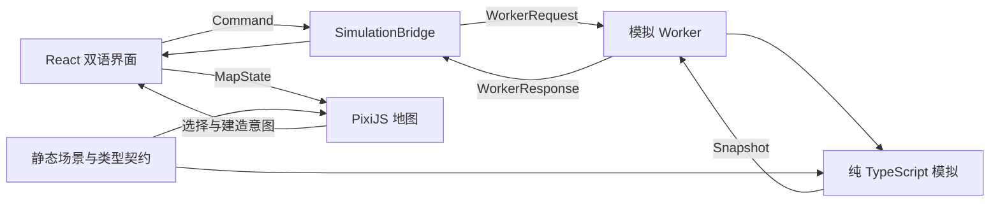

# 架构与状态流

## 设计原则

模拟拥有真实状态，界面发送意图，地图呈现快照。算法可在无浏览器环境下运行和测试；绘制速度不会改变车辆预约。主线程不直接修改资金、轨道或车辆。

## 边界与生命周期

- `shared/types.ts` 定义可结构化复制的协议；游戏对象不含 DOM、React 或 PixiJS 引用。
- `scenarios/city.ts` 固定 33 栋建筑及造价配置。`network/planTrack` 统一预览和施工几何，支持多拐点和切分既有边。
- 绘轨草稿只存在 UI 中；事务提交会再次检查费用、建筑避让和已有预约。运营中的繁忙轨道需先暂停接单并等待已预约车辆清空，才能切分或拆除。
- PixiJS 将输入集中到稳定的 stage，通过世界坐标命中楼宇和边；高亮重绘不会销毁按下时的事件目标。
- `SimulationBridge` 为请求赋予 ID，并管理结果、超时和错误。快照发布与单次命令应答分离。
- Worker 独占模拟实例，按照离散秒推进。基础时速为每现实秒 6 个模拟秒；1×、3×、8× 是此基础上的倍率。
- 主线程隐藏时请求暂停。后台恢复时不补跑未模拟的时间；Worker 对每批推进量设置上限。
- App 持有语言、工具、选择和相机相关状态。这些属于交互状态，不回写模拟。
- 存档保存可继续运行的内部状态；导入先验证，成功后才替换当前世界。读取存档后暂停。
- 顶层 React 错误边界和 Worker 错误提示防止无解释的空白页面。

## 独立开发约定

Terra 子代理分批负责调度、渲染、界面、几何编辑、交互、客流经营、独立 QA 和建筑美术，文件归属互相隔离。主代理负责契约、场景、Worker/启动集成、玩法平衡、跨模块测试与浏览器验收。模块说明位于 `docs/modules/`。

修改规则时补相应规则测试，修改协议时检查全部消费方。纯视觉变化以浏览器对照验收，不用镜像实现细节的测试代替观看实际画面。

## 发布方式

`npm run build` 输出静态资源至 `dist/`，可用 `npm run preview` 本地预览。游戏模拟在本机浏览器内运行。当前版本无需账户服务或服务器模拟。
